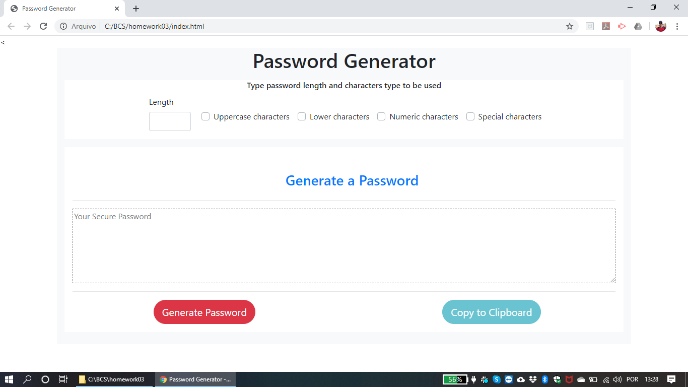

# Password Generator

The aim of this projetc is to generate a password automatically, based on the user choise of what should be its content, such as letters, numbers, special characteres, and the number of characteres.
To create this solution, HTML, Javascript and Bootstrap were used.

